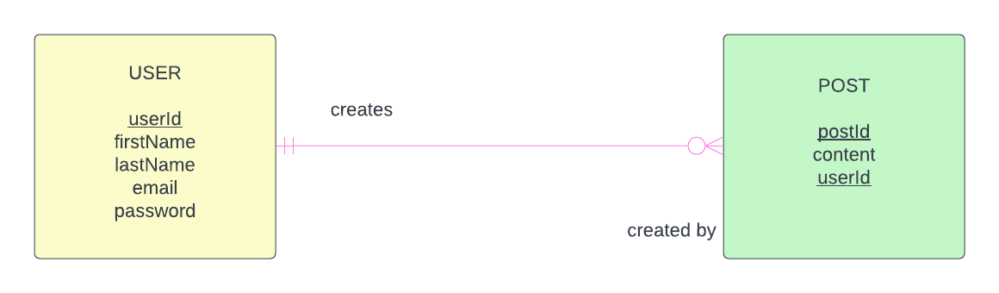

# Chirper - A Twitter-like Web Application

Chirper is a web application that mimics fundamental Twitter features, allowing users to share short messages (chirps).

Below is the E-R diagram of the entities:

